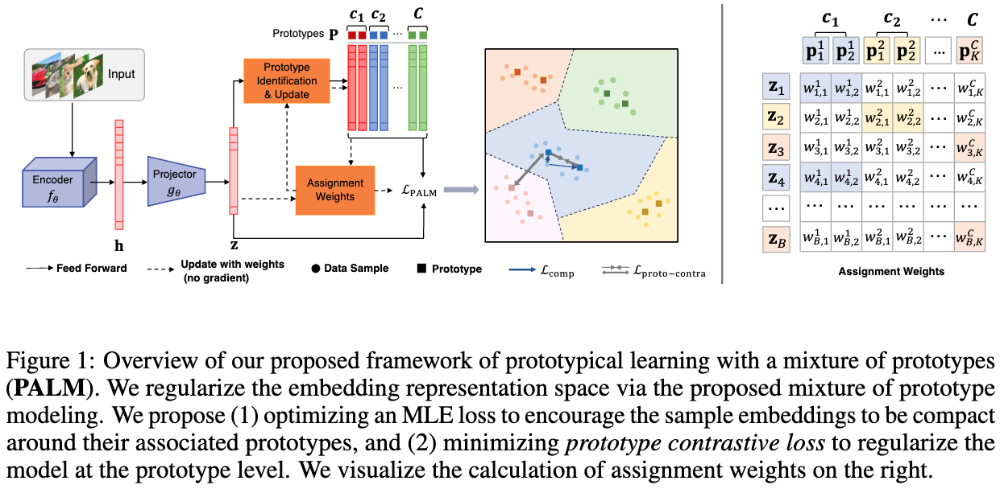
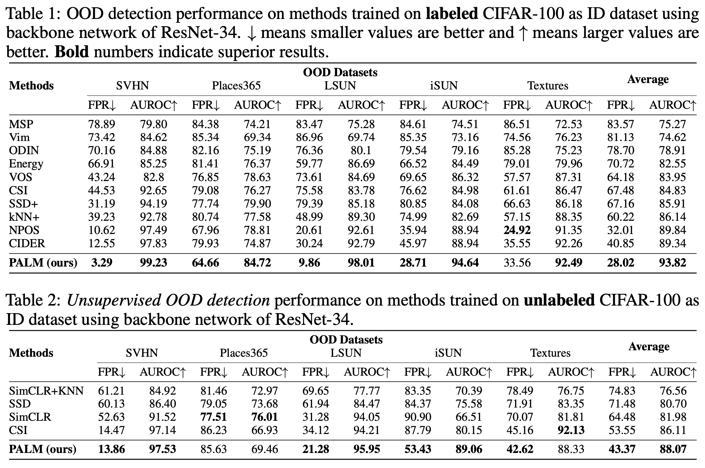

# PALM
This is official code repository for

[Learning with Mixture of Prototypes for Out-of-Distribution Detection](https://openreview.net/forum?id=uNkKaD3MCs)

Haodong Lu, [Dong Gong](https://donggong1.github.io/), Shuo Wang, [Jason Xue](https://people.csiro.au/x/j/jason-xue), [Lina Yao](https://www.linayao.com/), Kristen Moore

The Twelfth International Conference on Learning Representations (ICLR) 2024 

[[arXiv]](https://arxiv.org/abs/2402.02653)

## Method


## How To Start

### Requirements
All experiments were conducted using the following libraries on a single RTX3090 GPU.
- Python 3.10.11
- Pytorch 2.0.1
- tqdm


### Prepare Datasets
The default root directory for ID and OOD datasets is `data/`.

**ID datasets** Datasets like CIFAR-10 & CIFAR-100 will be automatically downloaded.

**OOD datasets** We use SVHN, Textures (dtd), Places365, LSUN-C (LSUN) and iSUN as our primary OOD datasets in our experiments.

OOD datasets can be downloaded via the following links :

* [SVHN](http://ufldl.stanford.edu/housenumbers/test_32x32.mat): download it and place it in the folder of `data/svhn`. Then run `python util/loaders/select_svhn_data.py` to generate test subset.
* [Places365](http://data.csail.mit.edu/places/places365/test_256.tar): download it and place it in the folder of `data/places365/test_subset`. We randomly sample 10,000 images from the original test dataset. 
* [LSUN](https://www.dropbox.com/s/fhtsw1m3qxlwj6h/LSUN.tar.gz): download it and place it in the folder of `data/LSUN`.
* [iSUN](https://www.dropbox.com/s/ssz7qxfqae0cca5/iSUN.tar.gz): download it and place it in the folder of `data/iSUN`.
* [Textures](https://www.robots.ox.ac.uk/~vgg/data/dtd/download/dtd-r1.0.1.tar.gz): download it and place it in the folder of `data/dtd`.


### Training and Evaluation
The training and evaluation scripts are presented in `runner.sh` file.

### Pretrained weights
Please check out our pretrained weights [here](https://unsw-my.sharepoint.com/:f:/g/personal/z5183944_ad_unsw_edu_au1/EusPiWrdFnZKqqeiWeJQEr8BpyVhXLUfmYbG6OpXivhqeA?e=aAjqhP), and configure the `save_path` argument in `runner.sh` for evaluation.


## Experiment Results


## Citation
If you find our work useful, please consider citing our paper:

```
@inproceedings{
PALM2024,
title={Learning with Mixture of Prototypes for Out-of-Distribution Detection},
author={Haodong Lu, Dong Gong, Shuo Wang, Jason Xue, Lina Yao, Kristen Moore},
booktitle={The Twelfth International Conference on Learning Representations},
year={2024},
url={https://openreview.net/forum?id=uNkKaD3MCs}
}
```
